## Ejercicios

1. Refactoriza el código del juego para adherirse a los principios SOLID 

## Single Responsibility Principle (SRP)

En jugador se está usando métodos que serían más adecuados para una clase inventario y no dentro de la misma clase Jugador, como son los de agregar objeto o usar objeto

- Nueva clase Jugador
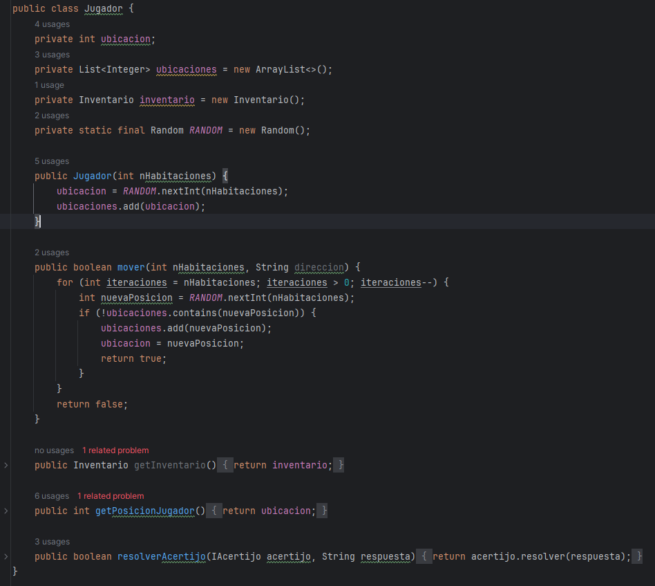

- Nueva clase Inventario
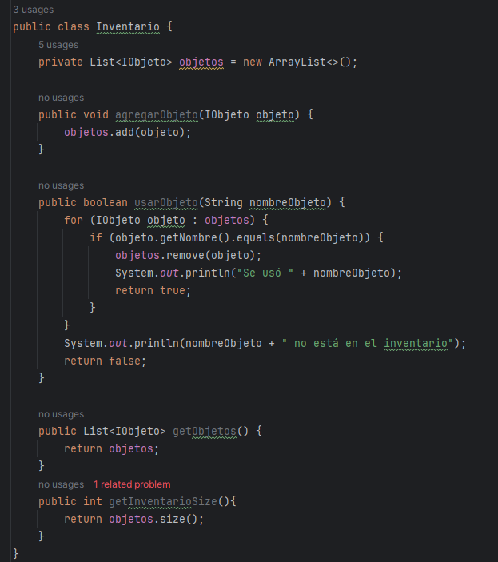

## Open/Closed Principle (OCP)

Luego, creamos una interfaz Comando para los comandos del jugador y la extendemos para implementar nuevos comandos sin modificar las clases existentes.
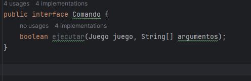

Y las correspondientes clases que reemplazarán luego a los métodos en la clase *Juego* 
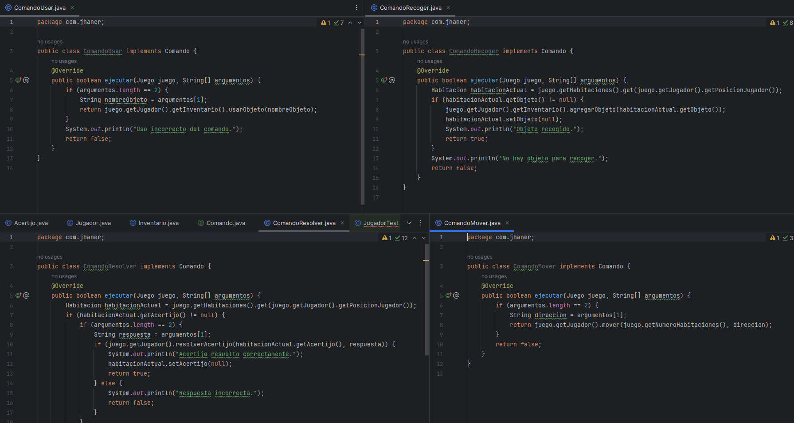

## Liskov Substitution Principle (LSP)
Debido a que no se han utilizado subclases, no hay cambios notables que haces. Sin embargo, como ya se utilizan interfaces podemos sustituir implementaciones fácilmente

## Interface Segregation Principle (ISP)

Dividimos las interfaces grandes en interfaces más específicas y pequeñas.

Como ya existe IHabitación y IJugador, creamos IInventario 

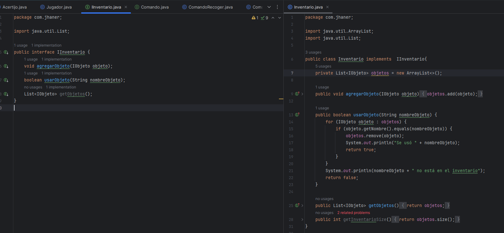

## Dependency Inversion Principle (DIP)
Usamos interfaces o clases abstractas para definir dependencias y luego implementamos estas abstracciones.

Implementamos las abstracciones creadas con OCP para agregar los comandos

Y ejecutar los comandos 
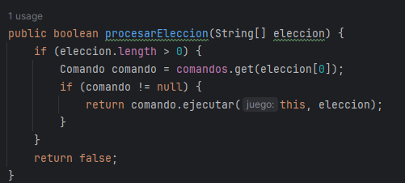

## Test 

Siguen funcionando los test
- JugadorTest
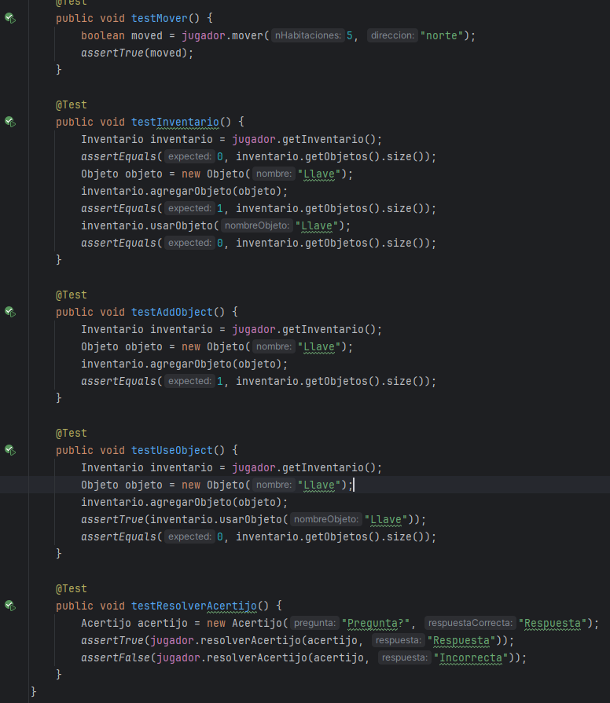
- HabitacionTest
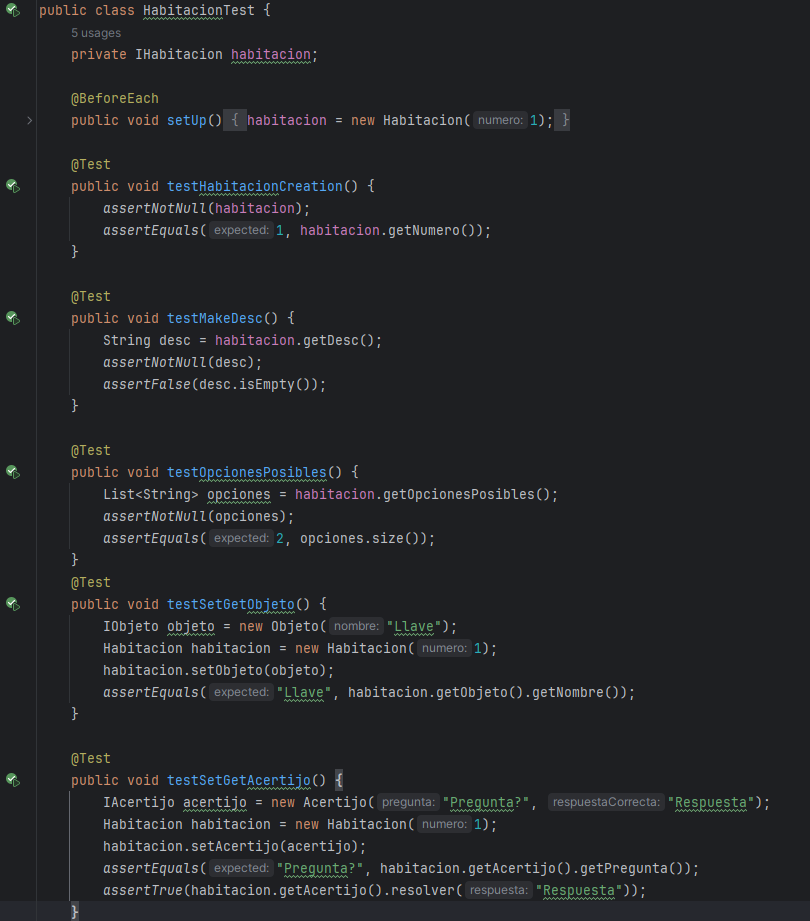

2.  Implementar Jacoco para medir la cobertura de código del proyecto del juego y asegurarse de que las pruebas cubran un alto porcentaje del código

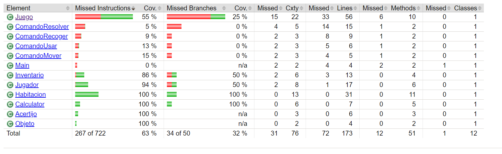

Se puede ver que Juego tiene poca cobertura y esto debido a que no se implementaron pruebas de ingreso de datos, sin embargo se pueden agregar pruebas para mejorar la cobertura

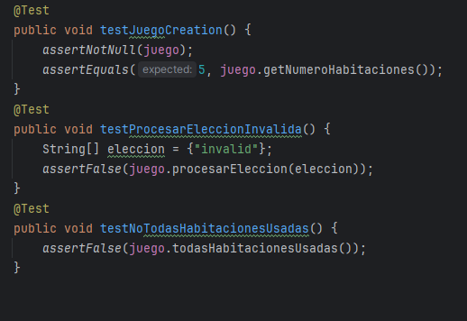

Se observa como mejoró la cobertura
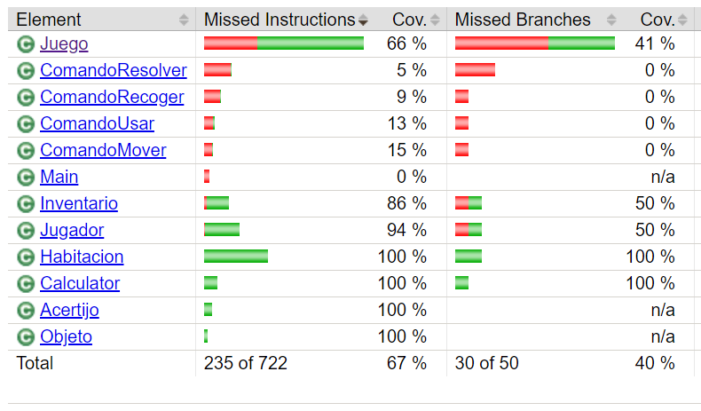