# Sprint 1

## Clase Habitación

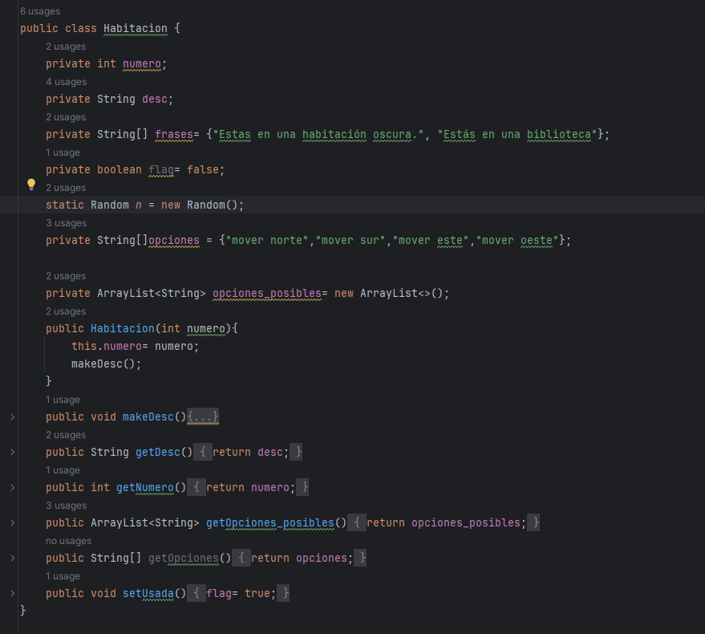

Atributos:
Numero de habitación
Descripcion de la habitación
Frases por habitación
Acciones por habitación

Metodos:
makeDesc: Creacion de descripcion con algunas de las opciones para esa habitación
getDesc: obtener la descripcion
getNumero: obtener el numero
getOpciones_posibles: obtener las opciones de las 4 
setUsada: indicar como habitacion ya visitada

## Clase Jugador
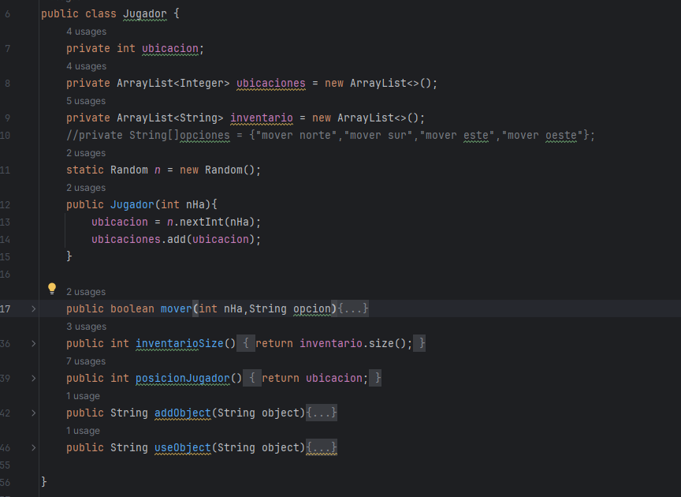

Atributos:
Ubicación: número de habitación
ubicaciones: orden de habitaciones visitados
inventario

Metodos:

mover: mover la ubicación a la ingresada por el usuario
inventarioSize: tamaño del inventario
posiciónJugador: obtener posicion
addObject: añadir un objeto al inventario
useObject: quitar un objeto del inventario

## Clase Juego
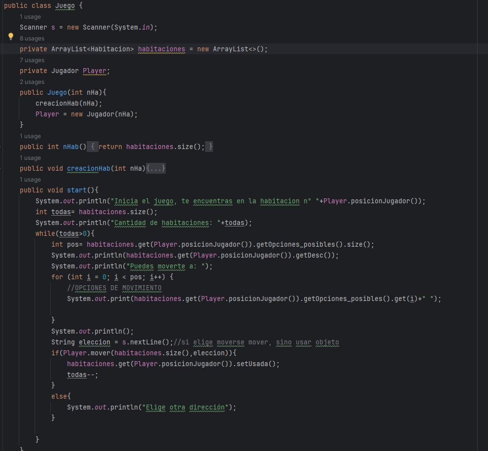

atributos:
array de habitaciones
objeto Jugador

metodos:
Constructor: requiere la cantidad de habitaciones
CreacionHab: agrega nuevas habitaciones al array
Start: Inicia el juego y se ejecuta un bucle hasta que no queden habitaciones

## Tests

### HabitacionTest

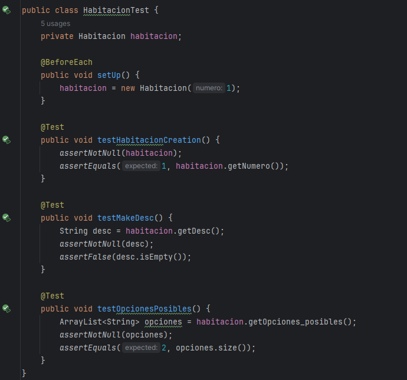

Para cada test se crea una habitación en el juego.
- Test de creacion de habitación, debe retornar 1 
- Test de crear Descripcion, verifica que la descripcion de la habitacion no sea vacía
- Test de Opciones Posibles, debe devolver siempre 2 opciones para cualquier habitación 

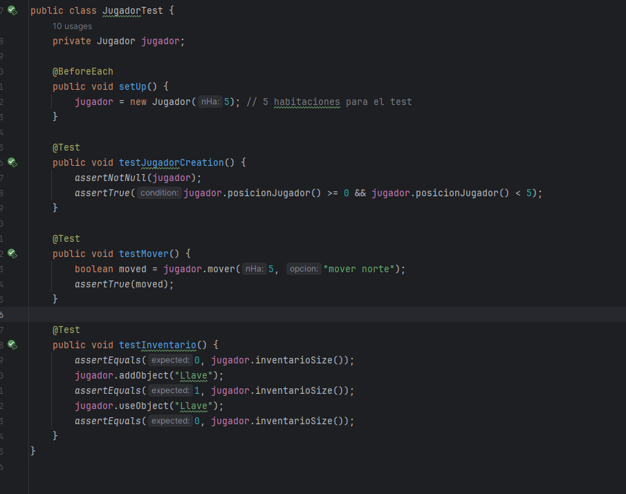

## JugadorTest

Para 5 habitaciones
- Test para verificar la creación de jugador, si el jugador no es nulo y la posicion de este mismo esta en el rango de habitaciones
- Test para mover al jugador, para el numero de habitación nos intentamos mover hacía una posición válida y debería de ser verdadero
- Test para verificar los cambios en el inventario, al agregar o usar objetos

## JuegoTest 
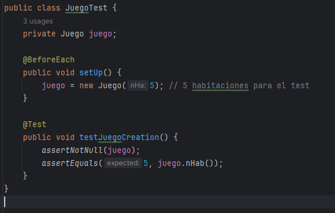
Para 5 habitaciones

- Test de creacion de juego, válida al objeto como no nulo y que el objeto juego tenga 5 habitaciones

## Refactorización

Todos los tests pasan, sin embargo el código es poco legible y los nombres de las funciones no dan mucha información sobre de qué trata el mismo

Así que en *Habitacion* se modifica el crear la descripción 
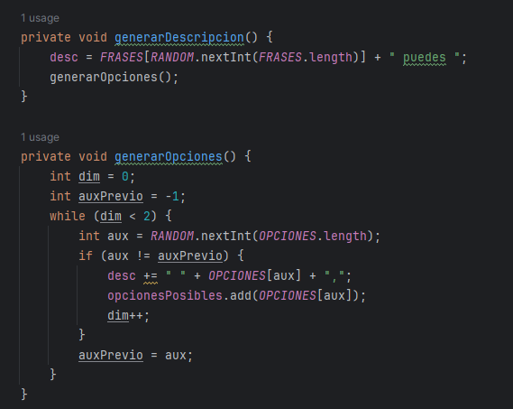

en el caso de *Juego* se modifica la lógica del juego 
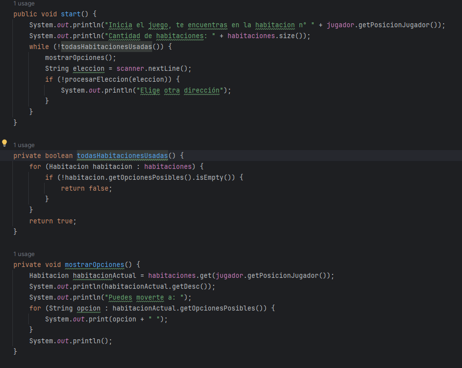

mientras existan habitaciones posibles se muestran las opciones y se pide elegir una dirección y se ingresa una dirección

Los test siguen pasando

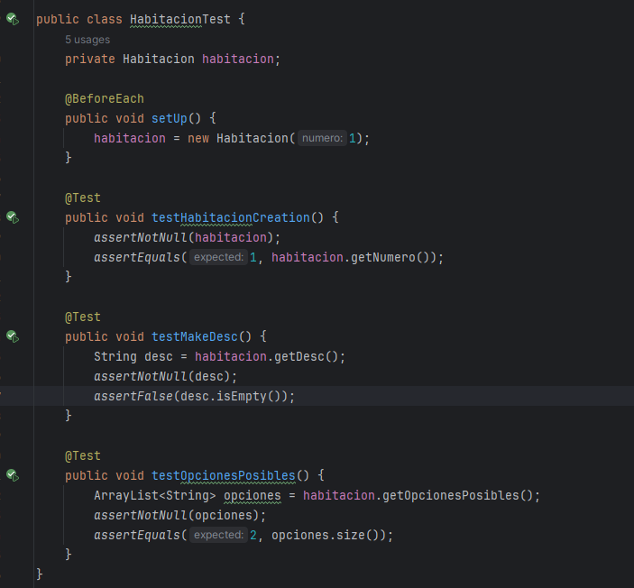

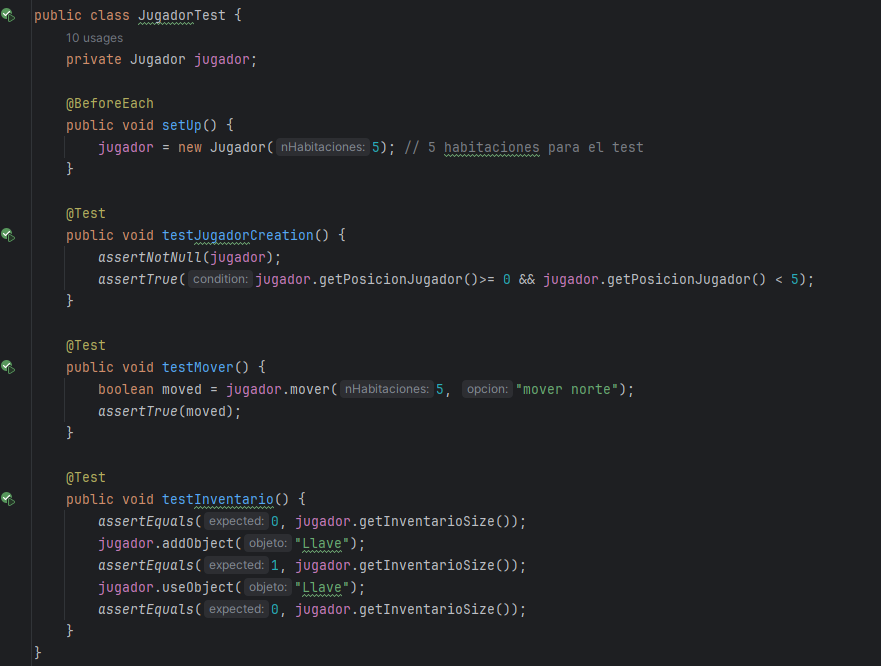
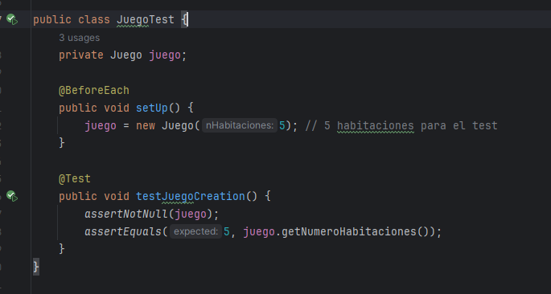