# Sprint 2

Se actualizan las clases para los nuevos requisitos

## Clase Objeto

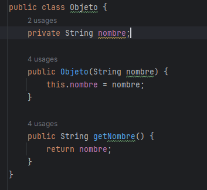

Atributos:
- Nombre

## Clase Acertijo

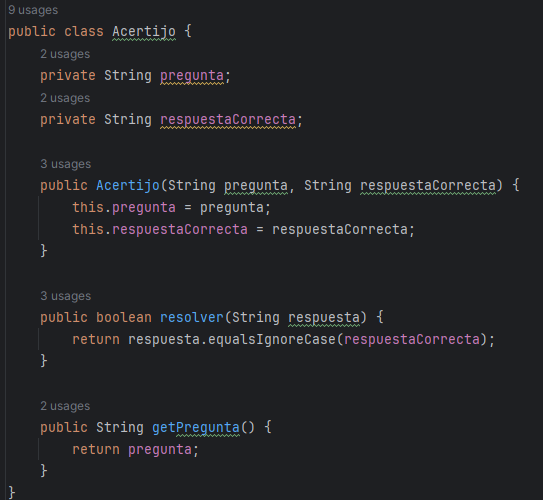
Atributos:
- Pregunta
- RespuestaCorrecta
Métodos:
- Resolver: validar la respuesta
- getPregunta: obtener la pregunta

## Clase Habitación
 Se actualizan los atributos agregando objetos y acertijos con sus respectivos getters y setters.
 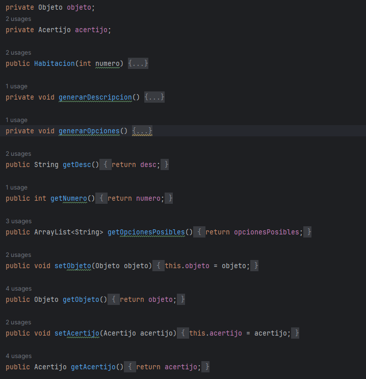

## Clase Jugador

Se actualiza la clase.
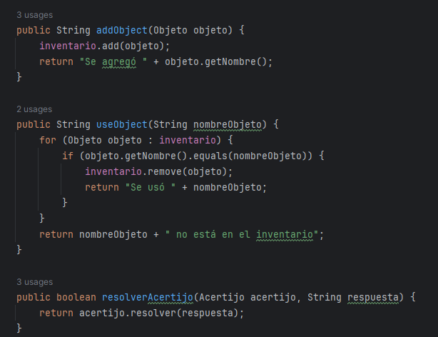

Metodo addObject: ahora se requiere por parámetro un Objeto
useObject: busca en el inventario de objetos y quita el objeto del arreglo
resolverAcertijo: intenta resolver el acertijo

## Clase Juego

Se actualiza la lógica del juego para poder llenar las habitaciones con sus respectivos objetos y acertijos según sean par o impar
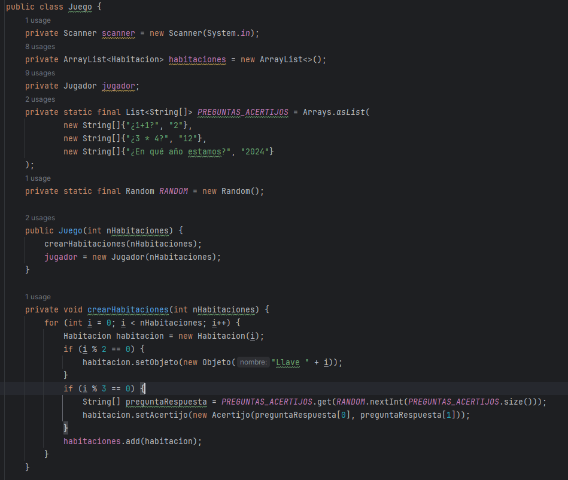

Mostramos las opciones según la habitación 
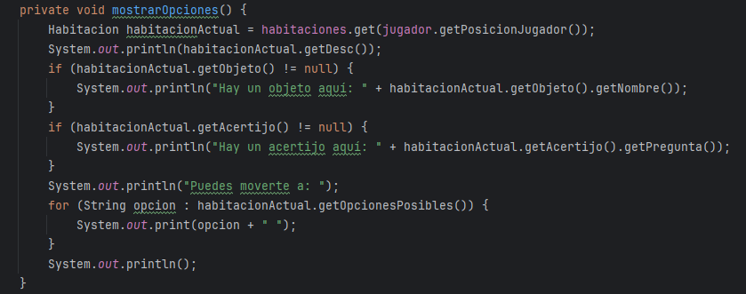

Según la primera palabra del comando ingresado, luego busca en la habitación actual, si es recoger objeto, usar objeto y usando split obtiene que objeto vamos a utilizar; sino resolver que intenta resolver el acertijo devolviendo el resultado de procesar la elección

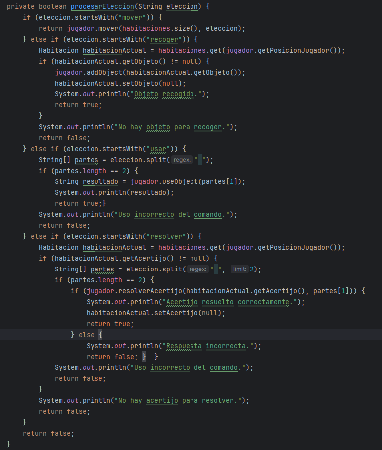

## Tests

### Clase Objeto
Crea un objeto de nombre llave y valida que retorne su nombre
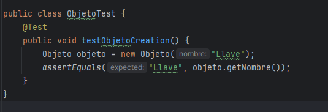

### Clase Acertijo
Se crea un acertijo, se valida la pregunta y la respuesta correcta e incorrecta
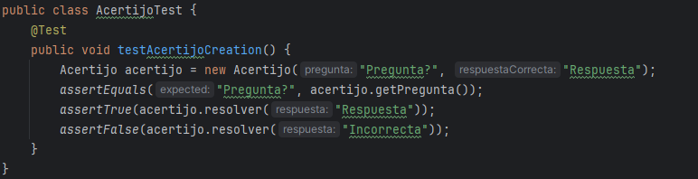

## Cambios en tests

Debido a que se agregaron objetos y acertijos se necesita cambiar los tests, además de agregar otros nuevos

## Test Jugador
Para validar agregar un objeto, quitarlo y resolver un acertijo
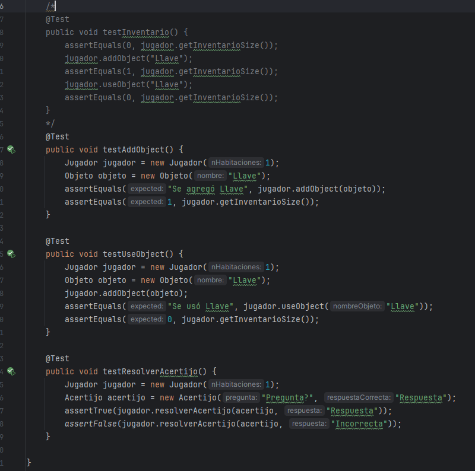

Todo lo demás sigue funcionando 
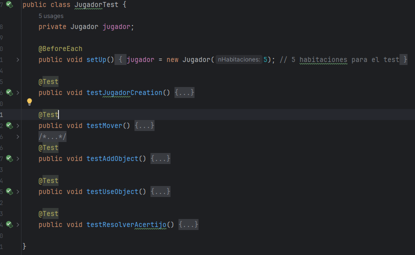

## Test Habitación
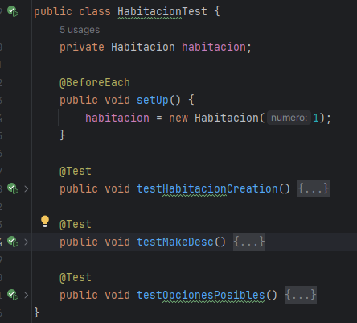

## Test Juego
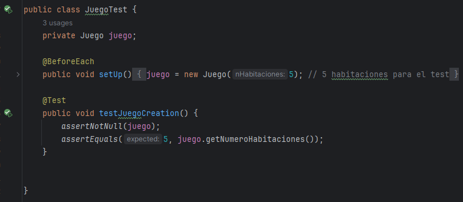