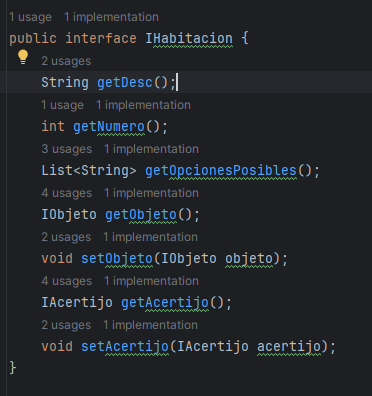
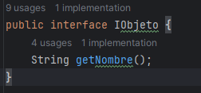
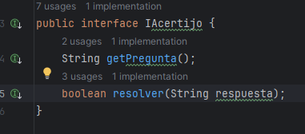
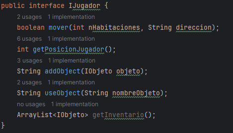
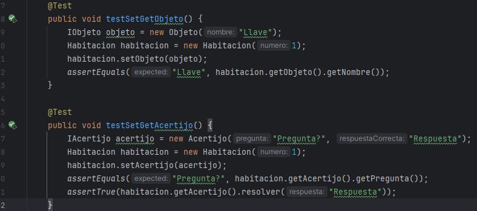
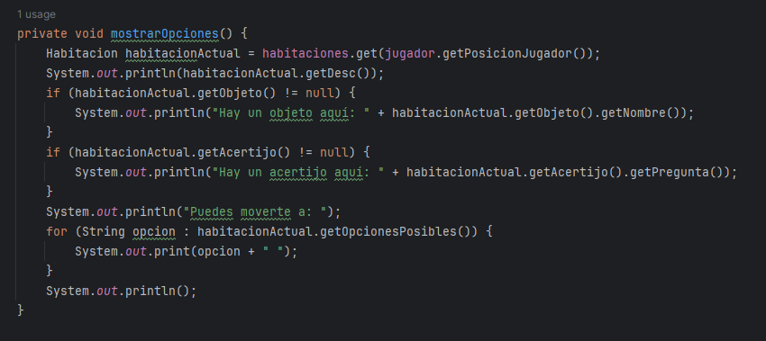

# Sprint 3
Dependencias Actuales entre las Clases
- Clase Juego

Depende de: Habitacion, Jugador, Objeto, Acertijo
Clases dependientes: Ninguna 

- Clase Habitacion

Depende de: Objeto, Acertijo
Clases dependientes: Juego
- Clase Jugador

Depende de: Objeto, Acertijo
Clases dependientes: Juego
- Clase Objeto

Depende de: Ninguna
Clases dependientes: Habitacion, Jugador
- Clase Acertijo

Depende de: Ninguna
Clases dependientes: Habitacion, Jugador
Cálculo de Métricas
## Clase Juego
Ce: 4 (Habitacion, Jugador, Objeto, Acertijo)
Ca: 0
I: 4 / (4 + 0) = 1.0
## Clase Habitacion
Ce: 2 (Objeto, Acertijo)
Ca: 1 (Juego)
I: 2 / (2 + 1) = 0.67
## Clase Jugador
Ce: 2 (Objeto, Acertijo)
Ca: 1 (Juego)
I: 2 / (2 + 1) = 0.67
## Clase Objeto
Ce: 0
Ca: 2 (Habitacion, Jugador)
I: 0 / (0 + 2) = 0.0
## Clase Acertijo
Ce: 0
Ca: 2 (Habitacion, Jugador)
I: 0 / (0 + 2) = 0.0

## Nuevas clases e interfaces
Podemos usar interfaces para desacoplar clases 

aplicando esto a nuestras clases resulta que: 
## Clase Habitacion

Depende de: IObjeto, IAcertijo
Clases dependientes: Juego, IHabitacion
## Clase Jugador

Depende de: IObjeto, IAcertijo
Clases dependientes: Juego, IJugador

- Clase Habitacion
Ce: 2 (IObjeto, IAcertijo)
Ca: 2 (Juego, IHabitacion)
I: 2 / (2 + 2) = 0.5
- Clase Jugador
Ce: 2 (IObjeto, IAcertijo)
Ca: 2 (Juego, IJugador)
I: 2 / (2 + 2) = 0.5

reduciendo sus acoplamiento

## Tests

Se agregaron tests para verificar los objetos y acertijos en la clase habitación 

## Mejoras 

Se mejoró la narrativa para que el jugador comprenda a su entorno 

